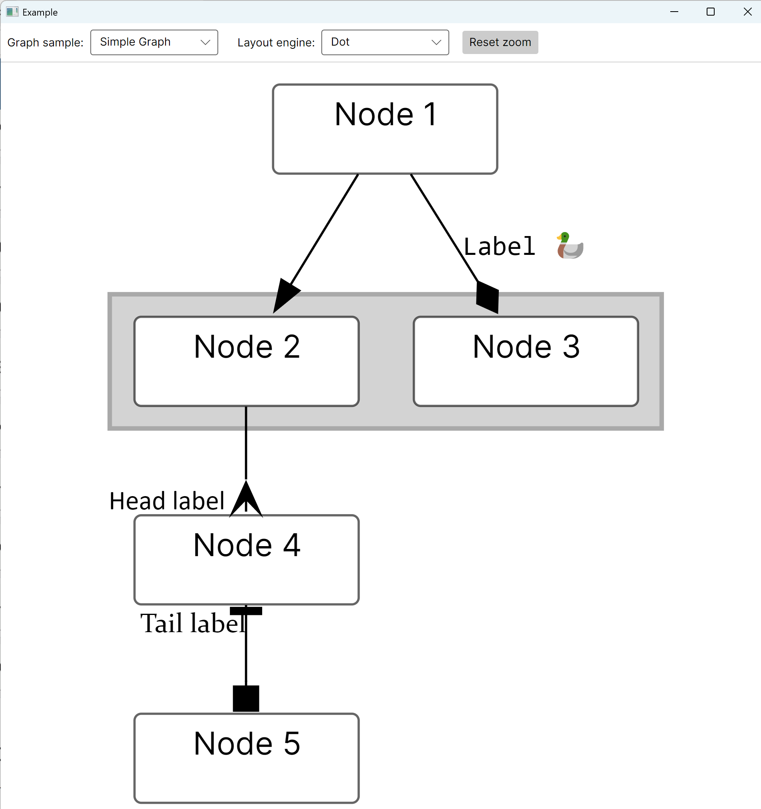
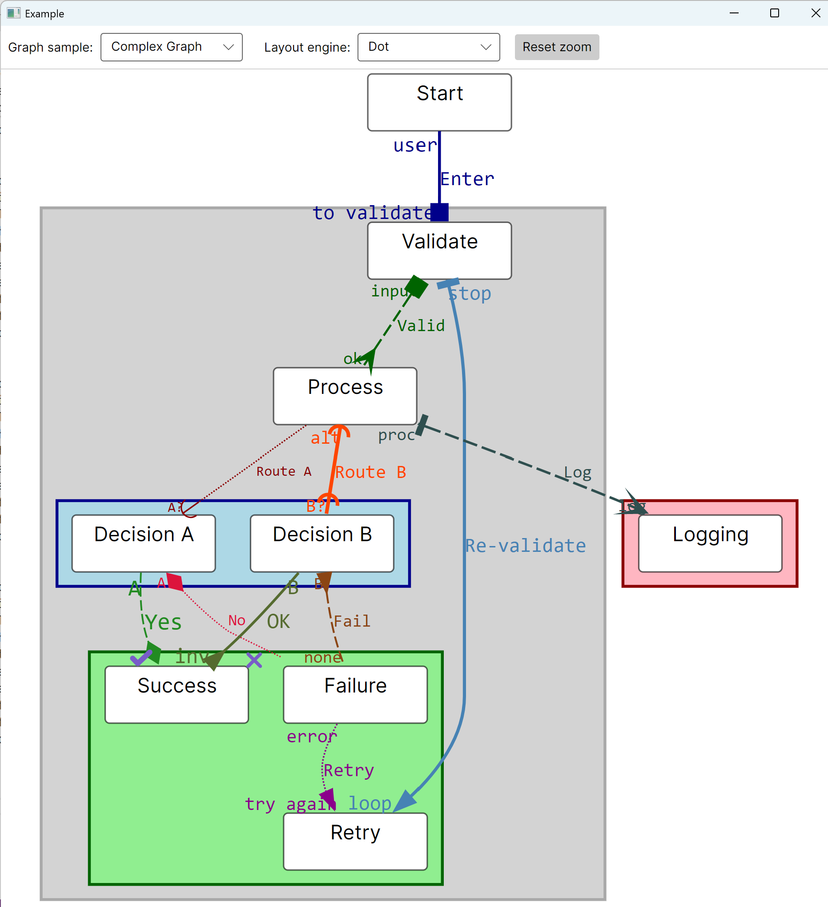

# GraphvizAvalonia

An [AvaloniaUI](https://avaloniaui.net/) control that displays an interactive graph. It uses Graphviz to create a layout. 
It is an alternative to:
* [Graphviz4Net](https://github.com/frblondin/Graphviz4Net)
* [AvaloniaGraphControl](https://github.com/Oaz/AvaloniaGraphControl)

# Features
* Uses [Graphviz](https://graphviz.org/) to create layout.
* Support all [Graphviz layout engines](https://graphviz.org/docs/layouts/).
* You can use different `AvaloniaUI` controls for nodes and clusters depending on the `ViewModel` that you specify.
* Clusters are also `AvaloniaUI` controls like nodes.
* Support all [Graphviz line arrow shapes](https://graphviz.org/doc/info/arrows.html).
* Support curve labels: middle, head, and tail.
* Uses Graphviz directly via `DllImport`.

# Limitations
* Requires Graphviz binaries to be present on the system.
* Arrows can only point from one node to another. Arrows pointing from a node to a cluster, or from a cluster to another cluster, are not supported.

# Current status
The library is in an early stage of development. All functionality works. However, the interfaces might change in the future.

# Screenshots

# How to use
Please look at the [Example](https://github.com/PolarGoose/GraphvizAvalonia/tree/main/src/Example). 
Key points:
* The library requires Graphviz binaries to be in the `Path`, so that C# `DllImport` can find them. Otherwise, you need to call the `GraphvizBinariesLocation.Set` method to specify the folder with the binaries.
You can also use a prebuilt event to download and unpack the binaries (look at the [Example.csproj](https://github.com/PolarGoose/GraphvizAvalonia/blob/main/src/Example/Example.csproj))
* In an `.axaml` file, you add a GraphCanvas control and specify what UI controls will be used for Nodes and Clusters. [MainWindow.axaml](https://github.com/PolarGoose/GraphvizAvalonia/blob/main/src/Example/MainWindow.axaml)
* In C# code, you specify the graph using the `GraphDescription` class, and you pass the `ViewModel` that needs to be used to display a particular Node or Cluster. [SimpleGraph.cs](https://github.com/PolarGoose/GraphvizAvalonia/blob/main/src/Example/GraphsSamples/SimpleGraph.cs)
* After you create `GraphDescription`, you need to call `GraphCanvas.DrawGraph(graphDescription, layoutEngine)` method that will visualize the graph. 
Note: node sizes depend on the UI control's desired size. Subgraphs are sized according to what Graphviz determines to be optimal.

# Implementation details
The library converts the `GraphDescription` into a Graphviz dot language. Then it passes it to Graphviz and gets JSON output containing coordinates for nodes and clusters, and instructions for drawing lines and labels.
